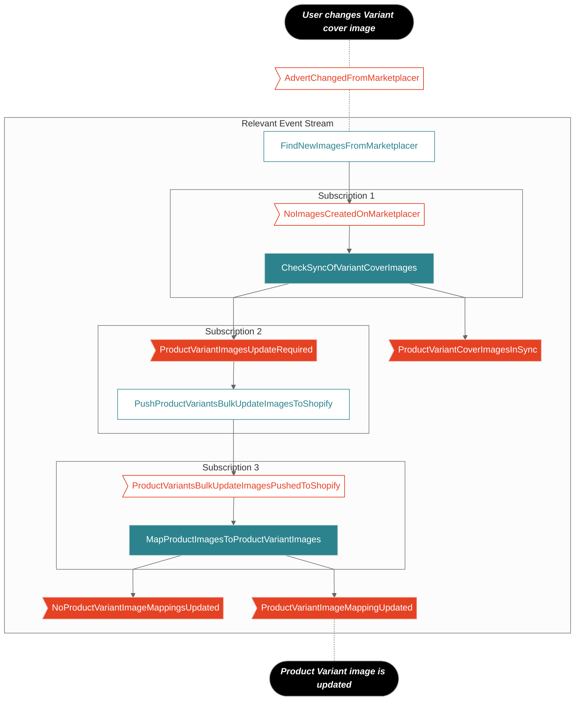

<pre>
flowchart TB

 %% Diagram ----------------------------------------------------------------------
  n1([User changes Variant cover image])
  n1 -.- e7
  e7>AdvertChangedFromMarketplacer] -.- h1
  subgraph Relevant Event Stream
    h1[FindNewImagesFromMarketplacer] --> e1
    subgraph Subscription 1
      e1>NoImagesCreatedOnMarketplacer] --> h2
      h2[CheckSyncOfVariantCoverImages]
    end
    h2 --> e2
    h2 --> e6
    subgraph Subscription 2
      e2>ProductVariantImagesUpdateRequired] --> h3
      h3[PushProductVariantsBulkUpdateImagesToShopify]
    end
    e6>ProductVariantCoverImagesInSync]
    h3 --> e3
    subgraph Subscription 3
      e3>ProductVariantsBulkUpdateImagesPushedToShopify] --> h4
      h4[MapProductImagesToProductVariantImages]
    end
    h4 --> e11
    h4 --> e4
    e4>ProductVariantImageMappingUpdated]
    e11>NoProductVariantImageMappingsUpdated]
  end
  e4 -.- n2
  n2(["Product Variant image is updated"])

  %% Diagram-Specific Class Assignments ------------------------------------------
  class h2,h4 handler
  class h1,h3,h5,h6,h7,h8 handler-alt
  class e2,e4,e5,e6,e11 event
  class e1,e3,e7,e8,e10 event-alt
  class n1,n2,n3 desc
  class n1,n2,n3 stage
  class e5 failed

  %% General MP Style Declarations -----------------------------------------------
  %%{init {"theme":"neutral","flowchart": {"curve": "linear"}}}%%
  classDef default fill:#f2f2f2,stroke:#999,color:#666
  classDef handler stroke:#bfdadd,fill:#2c838d,color:#fff
  classDef handler-alt fill:#fff,stroke:#2c838d,color:#2c838d
  classDef event fill:#e54224,stroke:#f7c6bd,color:#fff
  classDef event-alt fill:#fff,stroke:#e54224,color:#e54224
  classDef sub fill:#fff,stroke:f7c6bd,stroke-width:2px,color:#f3722c
  classDef desc font-family:helvetica,font-style:italic,font-weight:bold
  classDef failed stroke:#f94144,stroke-width:3px
  classDef stage fill:#000,stroke:#999,color:#fff
  </pre>
